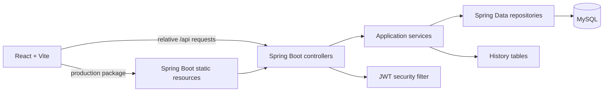
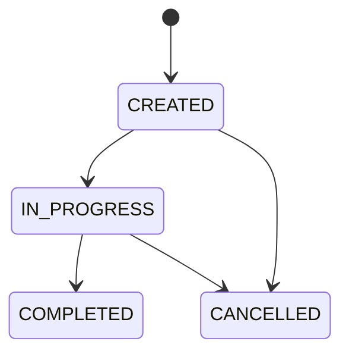

# Backend Documentation

This document is the high-level source of truth for the backend in this repository. It describes the behavior and
operating model implemented by the current source code, configuration, migrations, tests, and deployment manifests.
For endpoint-level request and response details, see the [API contract](API-CONTRACT.md).

Documentation should be updated when a controller, DTO, service rule, security rule, migration, profile, build step, or
deployment behavior changes.

## Contents

- [Purpose](#purpose)
- [Architecture](#architecture)
- [Source organization](#source-organization)
- [Runtime and setup](#runtime-and-setup)
- [Configuration](#configuration)
- [Security model](#security-model)
- [Domain and persistence](#domain-and-persistence)
- [Application behavior](#application-behavior)
- [API surface](#api-surface)
- [Testing and validation](#testing-and-validation)
- [Packaging and deployment](#packaging-and-deployment)
- [Design tradeoffs](#design-tradeoffs)
- [Known limitations](#known-limitations)
- [Change rules](#change-rules)

## Purpose

The backend is a Spring Boot application for care-referral coordination. It provides the API used by the React
frontend to manage members, coordinators, referrals, registration requests, SLA-extension requests, and event-driven
notifications.

The backend is a modular monolith: HTTP controllers, business services, persistence, authentication, and the packaged
frontend are delivered as one Spring Boot application. MySQL is the system of record for application data.

### Technology baseline

| Concern | Current implementation |
| --- | --- |
| Language and runtime | Java 25 |
| Application framework | Spring Boot 4.1.0 |
| Build | Maven multi-module build |
| Persistence | Spring Data JPA and MySQL |
| Schema management | Flyway versioned SQL migrations |
| Authentication | Stateless JWT with JJWT 0.12.6 |
| Password storage | BCrypt password encoder |
| Frontend integration | React/Vite build copied into backend resources |
| Tests | Spock/Groovy, Spring test support, and Testcontainers MySQL |
| Local database | Docker Compose MySQL |
| Deployment | Container image and Kubernetes resources under `infrastructure/dev/` |

## Architecture



### Request path

1. The frontend calls relative `/api` or `/actuator/` paths.
2. Vite proxies those paths to `localhost:8080` during local development.
3. Spring Security evaluates the request and, when required, validates its JWT.
4. A controller maps HTTP input to a service call.
5. A service applies business rules and coordinates repositories.
6. JPA reads or writes MySQL entities and history records.
7. The controller serializes a DTO response.

In a packaged deployment, Maven copies `frontend/dist` into the backend's `public` resources. Spring Boot then serves
one application endpoint for both the browser application and the API.

## Source organization

| Path | Responsibility |
| --- | --- |
| `backend/src/main/java/com/optum/tdpbootcamp/controller/` | HTTP routes and response status declarations |
| `backend/src/main/java/com/optum/tdpbootcamp/dto/` | JSON request and response records |
| `backend/src/main/java/com/optum/tdpbootcamp/service/` | Business rules, workflows, and DTO mapping |
| `backend/src/main/java/com/optum/tdpbootcamp/model/` | JPA entities and domain enums |
| `backend/src/main/java/com/optum/tdpbootcamp/repository/` | Persistence queries |
| `backend/src/main/java/com/optum/tdpbootcamp/security/` | JWT creation, validation, and request filtering |
| `backend/src/main/resources/application*.yaml` | Base and profile-specific configuration |
| `backend/src/main/resources/db/migration/` | Flyway schema and seed migrations |
| `backend/src/test/groovy/` | Spock and Spring integration specifications |
| `frontend/dist/` | Build output copied into packaged backend resources |

The backend currently has controllers for authentication, people, referrals, administrator workflows, and notifications.

## Runtime and setup

### Prerequisites

- JDK 25
- Maven
- Docker Desktop or another Docker-compatible runtime
- Node.js 24 or newer when building the frontend as part of the Maven build

### Start locally

From the repository root:

```bash
mvn -pl backend spring-boot:run
```

The default `local` profile enables Spring Boot Docker Compose integration and starts the MySQL service defined in
[`docker-compose.yml`](../docker-compose.yml). The backend listens on `http://localhost:8080`.

Check readiness:

```bash
curl -i http://localhost:8080/actuator/health
```

The local database values are defined by the compose file:

| Setting | Value |
| --- | --- |
| Host | `localhost` |
| Port | `3306` |
| Database | `local_mysql` |
| User | `local_app_user` |
| Password | `local_12345678` |

When working on the frontend, start it separately from `frontend/`:

```bash
npm install
npm run dev -- --host localhost
```

### Profiles

| Profile | Purpose | Database/runtime behavior |
| --- | --- | --- |
| `local` | Default developer workflow | Enables the root Docker Compose MySQL service and debug logging |
| `dev` | Kubernetes deployment | Reads MySQL connection values from `MYSQL_HOST`, `MYSQL_DATABASE`, `MYSQL_USER`, and `MYSQL_PASSWORD` |
| `compiletime-tests` | CI/test execution | Disables Docker Compose so tests can use Testcontainers |

## Configuration

The base configuration is in [application.yaml](../backend/src/main/resources/application.yaml). Profile overrides are
loaded from the corresponding `application-<profile>.yaml` file.

| Variable | Use | Default or requirement |
| --- | --- | --- |
| `SERVER_PORT` | HTTP port | `8080` |
| `SPRING_PROFILES_ACTIVE` | Active Spring profile | `local` in the base configuration |
| `JWT_SECRET` | Base64-encoded HMAC signing secret | Local development default exists; deployments must provide a secret |
| `MYSQL_HOST` | MySQL host in the `dev` profile | Required by the `dev` profile |
| `MYSQL_DATABASE` | MySQL database in the `dev` profile | Required by the `dev` profile |
| `MYSQL_USER` | MySQL username in the `dev` profile | Required by the `dev` profile |
| `MYSQL_PASSWORD` | MySQL password in the `dev` profile | Required by the `dev` profile |
| `SPRING_SSL_BUNDLE_JKS_STANDARDTRUSTS_TRUSTSTORE_PASSWORD` | Truststore password | Configured default exists; deployment may override it |

The JWT expiration configured in the base application is 24 hours. The local JWT secret is for development only and must
not be reused as a deployment secret.

## Security model

### Authentication

Authentication is stateless. `POST /api/auth/login` returns a JWT, and protected requests send it as:

```http
Authorization: Bearer <token>
```

The token contains the user's email as `sub`, plus `role`, `name`, `externalId`, `iat`, and `exp` claims. The JWT filter
validates the signature and expiration before placing the authenticated identity into the request.

### Public routes

- `/api/auth/**`
- `GET /actuator/health`
- `GET /`, `/index.html`, `/assets/**`, and `/fonts/**`

All other routes require authentication.

### Explicit route authorization

The current `SecurityConfig` explicitly restricts:

| Route | Required role |
| --- | --- |
| `/api/admin/**` | `ADM` |
| `POST /api/members` | `ADM` |
| `POST /api/coordinators` | `ADM` |
| `POST /api/referrals` | `ADM` |
| `PUT /api/referrals/*/assign` | `ADM` |
| `PUT /api/referrals/*/status` | `CRD` or `ADM` |
| `PUT /api/referrals/*/priority` | `CRD` or `ADM` |
| `POST /api/referrals/*/sla-extension-requests` | `CRD` or `ADM` |

Other protected routes require a valid JWT at the framework boundary. Service-level rules and request fields may impose
additional business constraints; clients should use the [API contract](API-CONTRACT.md) as the endpoint reference.

### Roles

| Code | Meaning |
| --- | --- |
| `ADM` | Administrator |
| `CRD` | Care coordinator |
| `AUD` | Auditor |
| `MBR` | Member record; members cannot log in to the portal |

CSRF is disabled and sessions are stateless because the backend exposes a token-authenticated API.

## Domain and persistence

### Main entities

- `person`: members, coordinators, auditors, and administrators, including optional password and soft-delete fields.
- `referral`: member-linked care referral with type, priority, status, assignment, due date, notes, and timestamps.
- `registration_request`: admin-reviewed onboarding request.
- Referral history tables record status, assignment, priority, and due-date changes.
- `referral_sla_extension_request`: pending, approved, or rejected requests to change an SLA due date.

External IDs are computed from database IDs and role/type prefixes, such as `MBR-...`, `CC-...`, `AUD-...`, `ADM-...`,
and `REF-...`. Clients should treat them as opaque identifiers.

### Referral lifecycle

The database constrains the main status transitions:



Priority changes and due-date changes are recorded in dedicated history tables. Referral detail responses include audit
history, while notifications are assembled from the history streams relevant to the authenticated user.

### Flyway migrations

Flyway owns schema changes. The current migration chain is:

1. `V0.0.0__MYSQL_Baseline.sql`
2. `V1.0.0__Create_Schema.sql`
3. `V1.1.0__Seed_Data.sql`
4. `V1.2.0__Add_Referral_Created_Timestamp.sql`

Never edit or delete an applied migration. Add a new higher-versioned `V...__Description.sql` file for every schema
change. Flyway validates migration checksums at startup.

## Application behavior

### Registration

1. A user submits a registration request for `AUD` or `CRD`.
2. An administrator approves or rejects the request.
3. An approved user completes registration by setting a password.
4. The user logs in and receives a JWT.

The service prevents duplicate active requests and applies a cooldown after rejection. Passwords must be at least eight
characters and must match confirmation.

### Referral operations

The API supports listing and filtering referrals, creating referrals, status updates, due-date changes, reassignment,
priority changes, and SLA-extension requests. The detailed endpoint is documented in [API-CONTRACT.md](API-CONTRACT.md).

SLA extension requests are intentionally two-step: submission leaves the current due date unchanged; administrator
approval applies the requested date, while rejection leaves the original date intact. Only one pending SLA-extension
request is allowed for a referral.

### Notifications

`GET /api/notifications?since=<epoch-milliseconds>` returns notification events after the supplied UTC timestamp for the
authenticated user. The controller requires a non-negative `since` value. The service aggregates status, assignment, SLA
decision, due-date, priority, and newly-created-referral events, then sorts them newest first.

The frontend polls this endpoint; the backend does not provide WebSocket or server-sent-event delivery.

## API surface

The complete endpoint reference is maintained in [API-CONTRACT.md](API-CONTRACT.md). The route families are:

| Area | Routes |
| --- | --- |
| Authentication | `/api/auth/**` |
| People | `/api/members`, `/api/coordinators`, `/api/auditors` |
| Referrals | `/api/referrals/**` |
| Administration | `/api/admin/**` |
| Notifications | `/api/notifications` |
| Health | `/actuator/health` |

The API currently has no version prefix, pagination contract, sorting contract, refresh-token endpoint, or standardized
application error schema.

## Testing and validation

Backend tests use Spock/Groovy with Spring test support and Testcontainers MySQL. The `compiletime-tests` profile
prevents Docker Compose from starting during test execution.

Run the backend test suite from the repository root:

```bash
mvn -pl backend test
```

Other useful commands:

```bash
mvn -pl backend clean test
mvn -pl backend clean package
```

The test suite covers application startup, authentication, controller behavior, referral workflows, people endpoints,
administrator workflows, notifications, API response shapes, service rules, migration/data behavior, schema constraints,
and HTTP client configuration. The exact test files under `backend/src/test/groovy/` are the authoritative coverage list.

## Packaging and deployment

### Maven packaging

The backend Maven build:

1. Compiles the Java and Groovy sources.
2. Processes Spring Boot AOT tasks configured by the backend module.
3. Copies `frontend/dist` into the backend's `public` resources.
4. Produces the executable `backend/target/app.jar`.

Build from the repository root:

```bash
mvn -pl backend clean package
```

The frontend must have a current `dist` output when the package is assembled. The root Maven build includes the frontend
module, so a full root build is the preferred deployment build when frontend changes are included.

### Container and Kubernetes

The [Dockerfile](../Dockerfile) runs the packaged JAR on an internal OpenJDK 25 runtime image as the non-root `java`
user. It exposes port `8080`, uses graceful `SIGTERM` shutdown, and configures container-aware JVM memory limits.

The current deployment resources are under [infrastructure/dev](../infrastructure/dev). They define the application
Deployment and Service, Ingress, health probes, resource limits, network policy, image pull secret, and the MySQL
StatefulSet, Service, PVC, and Secret. Render changes before deployment:

```bash
kubectl kustomize infrastructure/dev
```

The repository currently provides the `dev` Kubernetes environment. Do not document additional environments until their
manifests and configuration exist.

## Design tradeoffs

### Modular monolith instead of distributed services

The backend keeps API, business logic, persistence, and the packaged frontend in one deployable unit. This reduces local
setup and deployment coordination for the capstone. The tradeoff is less independent scaling and release isolation
between frontend, API, and database concerns.

### Flyway migrations instead of Hibernate schema generation

Flyway makes schema history explicit, reviewable, and repeatable across environments. The tradeoff is that every schema
change requires a new migration and applied migrations cannot be edited safely.

### JWT instead of server-side sessions

Stateless JWT authentication keeps the API simple to scale horizontally and avoids server-side session storage. The
tradeoff is token revocation and password-reset support are not implemented; tokens remain valid until expiration.

### Dedicated history tables instead of one generic event table

Status, assignment, priority, and due-date history have explicit structures that support targeted queries and notification
aggregation. The tradeoff is more schema and service code, plus the need to update multiple history paths consistently.

### Polling notifications instead of server push

Polling `/api/notifications?since=...` is simple for the frontend and reuses persisted history. The tradeoff is delayed
delivery and repeated requests compared with WebSockets or server-sent events.

## Known limitations

- The API has no OpenAPI document or generated client contract.
- Error response bodies are not standardized through a shared exception handler.
- List endpoints do not provide pagination or sorting.
- There is no refresh-token, logout, password-reset, or token-revocation endpoint.
- Notification delivery is polling-only and is limited to events relevant to the authenticated user.
- The backend uses synthetic/demo data for local scenarios; this is not production healthcare data handling.
- The local JWT secret has a development default and must be overridden for deployment.
- The current Kubernetes configuration is a development environment, not a complete production platform.
- Time-bearing values use `LocalDateTime`/database datetime representations in parts of the model; consumers should verify
  timezone assumptions when integrating.

## Change rules

- Derive API documentation from controllers, DTOs, security configuration, and service behavior.
- Add a new Flyway migration for schema changes; do not rewrite applied migrations.
- Keep secrets and production data out of source control and examples.
- Run `mvn -pl backend test` after backend behavior changes.
- Run `mvn -pl backend clean package` when packaging or frontend integration changes.
- Render `kubectl kustomize infrastructure/dev` after deployment manifest changes.
- Keep this document and [API-CONTRACT.md](API-CONTRACT.md) synchronized with implementation changes.
