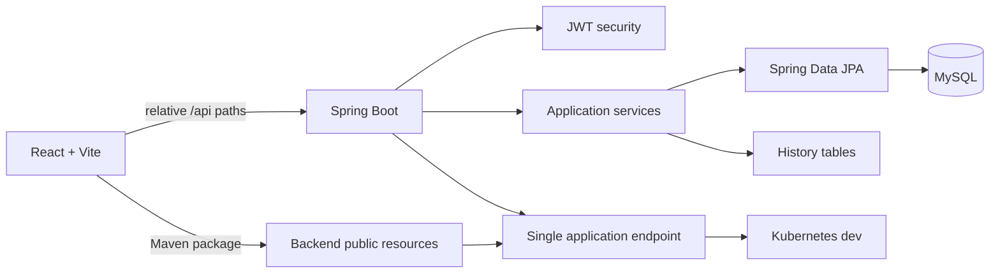

# Care Coordination Referral Hub

Care Coordination Referral Hub is a synthetic, healthcare-adjacent application for tracking referrals from creation to
resolution. It gives administrators, care coordinators, and auditors a shared view of ownership, status, priority, due
dates, SLA risk, and workflow history.

> **Data boundary:** All local and seeded records are synthetic demonstration data. This is not a clinical decision
> system and must not be used with real PHI or production credentials.

## Contents

- [Project Overview](#project-overview)
- [Problem and Goals](#problem-and-goals)
- [Solution and Features](#solution-and-features)
- [Architecture](#architecture)
- [Technology Stack](#technology-stack)
- [Design Decisions and Tradeoffs](#design-decisions-and-tradeoffs)
- [Setup](#setup)
- [Roles and Demo Accounts](#roles-and-demo-accounts)
- [Data and API](#data-and-api)
- [Testing and Quality](#testing-and-quality)
- [Deployment](#deployment)
- [Security and Limitations](#security-and-limitations)
- [Future Enhancements](#future-enhancements)
- [Documentation Map](#documentation-map)

## Project Overview

The application supports a closed-loop referral workflow:

```text
Synthetic member need
  -> referral created and assigned
  -> coordinator follow-up
  -> status, priority, and due-date changes
  -> audit history and notifications
  -> completed or cancelled referral
```

The portal serves three audiences:

- **Administrators** manage people, assignments, registrations, SLA reviews, and global referral operations.
- **Care coordinators** work assigned caseloads, update progress, and request SLA extensions.
- **Auditors** inspect referral data and history in read-only mode.

## Problem and Goals

Care teams need to coordinate referrals for specialists, behavioral health, labs, home health, transportation, and
community resources. When work is distributed across workflows, ownership can become unclear and overdue referrals can
surface only after delays occur.

The project aims to:

- Track referrals through a constrained lifecycle.
- Make ownership, workload, urgency, and overdue risk visible.
- Provide role-appropriate actions and read-only audit visibility.
- Preserve status, assignment, priority, and due-date changes.
- Support administrator-reviewed SLA extensions.
- Provide a repeatable local environment with synthetic data.
- Package the frontend and backend as one deployable application.

Clinical decision support, EMR integration, real PHI, and external provider integration are outside the project scope.

## Solution and Features

A React portal provides role-scoped views while a Spring Boot backend applies authentication, workflow rules, audit
history, and persistence.

| Area | Capabilities |
| --- | --- |
| Global Dashboard | Overdue, active, urgent, and closed metrics; referral search, filters, sorting, and detail |
| My Workflow | Coordinator caseload, SLA milestones, workload metrics, and notifications |
| 360 Member Profiles | Synthetic demographics, referral history, coordinator directory, and active case counts |
| Overdue Risk Center | Overdue trends, priority risk, coordinator summaries, and drill-down analysis |
| Access Control Center | Registration approval, auditor visibility, and SLA-extension review |
| Referral Management | Creation, assignment, status, priority, due-date, SLA, and audit-history workflows |

The SLA workflow separates direct administrator due-date changes from reviewed extension requests. Submitting an
extension leaves the current date unchanged until an administrator approves it.

## Architecture



During local development, Vite runs on port `5173` and proxies `/api` and `/actuator/` to Spring Boot on port `8080`.
For deployment, Maven copies `frontend/dist` into the backend package so the portal and API share one endpoint.

The request path is:

```text
React view -> typed API client -> Spring Security -> controller -> service -> repository -> MySQL -> DTO response
```

See [Backend Documentation](BACKEND.md) and [Frontend Documentation](FRONTEND.md) for implementation details.

## Technology Stack

| Layer | Technology |
| --- | --- |
| Frontend | React 19, TypeScript, Vite 8 |
| UI | Tailwind CSS, Abyss Web, Lucide React, React DatePicker, Enterprise fonts |
| Backend | Java 25, Spring Boot 4.1.0, Spring MVC |
| Persistence | Spring Data JPA, MySQL, Flyway |
| Security | Stateless JWT, JJWT, BCrypt |
| Testing | Vitest, React Testing Library, Spock, Spring Test, Testcontainers |
| Build | npm and Maven multi-module packaging |
| Runtime | Docker Compose locally; Docker, Kubernetes, and Kustomize for development deployment |
| CI/CD | GitHub Actions reusable build, scan, validation, and deployment workflows |

Abyss is installed but currently used primarily by the system health feature. Most portal UI is custom React with
Tailwind styling.

## Design Decisions and Tradeoffs

| Decision | Benefit | Tradeoff |
| --- | --- | --- |
| Modular monolith | One application to build, run, and deploy | Less independent frontend/API scaling |
| Spring Boot serves the frontend | One deployment endpoint and simple local parity | Frontend releases are coupled to backend packaging |
| MySQL and JPA | Relational integrity for ownership and history | Schema evolution requires migration discipline |
| Flyway instead of auto-DDL | Explicit and repeatable schema history | Applied migrations cannot be edited safely |
| Dedicated history tables | Targeted audit and notification queries | More schema and service paths to maintain |
| Stateless JWT | No server-side session storage | No refresh, revocation, or password-reset flow |
| Client-side table filtering | Responsive interaction for the current dataset | Larger datasets increase payload and browser work |
| Full refetch after mutations | UI remains aligned with server rules and audit data | Additional network traffic |
| Notification polling | Simple delivery over existing HTTP APIs | Delayed updates and repeated requests |

## Setup

### Prerequisites

- Node.js 24 or newer and npm
- JDK 25
- Maven
- Docker Desktop or another Docker-compatible runtime

### Start the backend and database

From the repository root:

```bash
mvn -pl backend spring-boot:run
```

The default `local` profile starts MySQL through Docker Compose, applies Flyway migrations, and serves the backend at
`http://localhost:8080`.

Verify readiness:

```bash
curl -fsS http://localhost:8080/actuator/health
docker compose ps
```

### Start the frontend

In a second terminal:

```bash
cd frontend
npm install
npm run dev -- --host localhost
```

Open [http://localhost:5173/](http://localhost:5173/).

### Stop local services

```bash
docker compose down
```

Troubleshooting and profile details are maintained in [Backend Documentation](BACKEND.md#runtime-and-setup) and
[Frontend Documentation](FRONTEND.md#runtime-and-setup).

## Roles and Demo Accounts

| Role | Email | Password | Portal access |
| --- | --- | --- | --- |
| Administrator | `admin@optum.com` | `admin123` | Full portal and administrative workflows |
| Coordinator | `jordan.lee@optum-style.com` | `coordinator123` | Dashboard, My Workflow, Members, assigned-referral actions |
| Auditor | `visitor@optum.com` | `visitor123` | Read-only dashboard and referral visibility |

These accounts are synthetic and intended only for local demonstration. Frontend role checks improve usability; backend
JWT authorization remains the security boundary.

## Data and API

MySQL stores people, referrals, registration requests, SLA-extension requests, and dedicated referral history records.
The referral lifecycle is constrained to:

```text
CREATED -> IN_PROGRESS -> COMPLETED
CREATED -> CANCELLED
IN_PROGRESS -> CANCELLED
```

Flyway owns schema changes. Never modify an applied migration; add a new higher-versioned migration instead.

The API is organized into these route families:

| Area | Routes |
| --- | --- |
| Authentication | `/api/auth/**` |
| People | `/api/members`, `/api/coordinators`, `/api/auditors` |
| Referrals | `/api/referrals/**` |
| Administration | `/api/admin/**` |
| Notifications | `/api/notifications` |
| Health | `/actuator/health` |

The [Backend API Contract](API-CONTRACT.md) is the authoritative HTTP reference for request fields, responses,
authorization, status codes, and examples.

## Testing and Quality

Frontend checks, run from `frontend/`:

```bash
npm test
npm run type-check
npm run lint
npm run build
```

Backend checks, run from the repository root:

```bash
mvn -pl backend test
mvn -pl backend clean package
```

Backend tests cover authentication, controllers, referral workflows, people, administration, notifications, API shapes,
service rules, migrations, and schema constraints. Current frontend automation focuses on the system health feature; core
login and referral workflows remain a coverage gap.

GitHub Actions builds with Java 25, performs quality and security scans, validates the development Kustomize output, and
deploys to the configured `dev` environment on pushes to `main` or manual dispatch.

## Deployment

The integrated Maven build produces `backend/target/app.jar` after building the frontend. The Docker image runs the JAR
as a non-root user on an OpenJDK 25 runtime.

```bash
mvn clean package
kubectl kustomize infrastructure/dev
```

The current Kubernetes development resources include the application Deployment, Service, Ingress, health probes,
resource constraints, network policy, MySQL StatefulSet, PVC, and Secrets. Only the `dev` environment is currently
implemented.

## Security and Limitations

- All records and examples must remain synthetic; real PHI is prohibited.
- Protected APIs require JWT authentication, and passwords are stored with BCrypt.
- The local JWT secret is a development default and must be replaced in deployment.
- Frontend role visibility is not a substitute for backend authorization.
- The container and Kubernetes configuration use non-root execution, health probes, resource limits, and network policy.
- The API has no OpenAPI document, version prefix, standardized error schema, or backend pagination contract.
- Authentication has no refresh-token, password-reset, logout API, or revocation workflow.
- Notifications use polling and have no persistent per-user archive.
- Frontend state is centralized in `App.tsx`, and core workflows have limited frontend test coverage.
- The current deployment is a capstone development environment, not a production healthcare platform.

## Future Enhancements

- Integrate enterprise authentication and authorization.
- Add OpenAPI and generated contract validation.
- Add backend pagination, sorting, and larger-dataset query support.
- Add durable notification read/archive behavior and server-push delivery where appropriate.
- Expand frontend workflow, accessibility, and role-authorization tests.
- Add production observability, backup, recovery, and deployment-promotion procedures.

## Documentation Map

| Document | Audience and ownership |
| --- | --- |
| [Backend Documentation](BACKEND.md) | Backend architecture, configuration, persistence, testing, packaging, and operations |
| [Frontend Documentation](FRONTEND.md) | Frontend state, views, workflows, styling, API integration, build, and tests |
| [Backend API Contract](API-CONTRACT.md) | HTTP methods, paths, authorization, request/response fields, statuses, and examples |

When documentation conflicts with source code, tests, configuration, migrations, or deployment manifests, those
implementation artifacts are authoritative and the documentation must be corrected.
