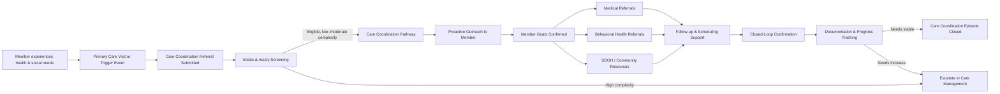

# Care Coordination & Referral Tracking Microservice

## Overview

This repository contains a Care Coordination & Referral Tracking Microservice designed for early‑career software
engineers to build and deploy a working healthcare‑adjacent application in an Optum‑style enterprise environment. The
goal is to design, implement, and demonstrate a production‑minded backend service (with a lightweight UI) that tracks
referrals created during care coordination workflows and provides visibility into referral status, ownership, and
timeliness—without using real patient data.

### What is Care Coordination

Care coordination is the organized facilitation of healthcare services, referrals, and supports across providers,
programs, and community resources to ensure members receive appropriate, timely, and continuous care aligned to their
clinical, behavioral, and social needs.

#### Example Member Journey



## Business Problem

Care coordinators and care teams routinely create referrals for follow‑up services such as specialists, labs, home care,
or social services. Once referrals are created, they are often:

- Tracked across multiple systems
- Missing clear ownership
- Difficult to monitor for timely follow‑up
- Identified as overdue only after delays occur

This lack of visibility creates operational inefficiencies and increases the risk of missed or delayed care.

### Problem to Solve

Build a service that:

- Tracks referrals end‑to‑end
- Provides clear referral ownership and status
- Automatically identifies overdue referrals
- Enables care teams to quickly understand what needs follow‑up

## What You Are Building

You will build:

- A backend microservice that manages referral data and workflows
- A simple UI that displays referrals and allows basic interaction
- Clear documentation explaining architecture, tradeoffs, and business rules

This is not a clinical system and does not involve real PHI.

## Scope & Constraints

### In Scope

- Referral lifecycle tracking
- Status transitions and validation
- Time‑based overdue logic
- Synthetic data generation
- REST APIs
- Basic UI for visibility and updates

### Out of Scope

- Clinical decision logic
- EMR integration
- Real PHI or member data
- External system dependencies (may be mocked)

✅ ***All data must be fake and clearly marked as synthetic***

## Core Concepts

### Referral Lifecycle

Referrals move through a defined lifecycle:

```yml
CREATED → IN_PROGRESS → COMPLETED
CREATED → CANCELLED
IN_PROGRESS → COMPLETED
```

A referral is considered OVERDUE when:

```yml
current date > due date AND status ≠ COMPLETED
```

> Note: OVERDUE is a derived state and should not be manually set.

## Data Model

The data model should reflect a realistic care coordination workflow while remaining fully synthetic and non-clinical.
The objective is to simulate how care teams track referrals, ownership, follow-up activities, and workload management
without using real member information.

### Entity Relationships

```text
Member (Synthetic)
    |
    | 1 : Many
    v
Referral
```

A single member may have multiple referrals over time. Each referral represents a request for follow-up services,
provider appointments, or community resources that require tracking, ownership, and timely resolution.

### Member (Synthetic)

Represents a fictional member receiving support through a care coordination program.

```json
{
  "memberId": "MBR-102938",
  "firstName": "Alex",
  "lastName": "Taylor",
  "dateOfBirth": "1982-06-15"
}
```

> All member records must be synthetic. Do not use real member, patient, provider, or employee information.

### Referral

Represents a referral requiring coordination, follow-up, and ownership by a care coordinator.

```json
{
  "referralId": "REF-784512",
  "memberId": "MBR-102938",
  "referralType": "SpecialistVisit",
  "priority": "HIGH",
  "status": "IN_PROGRESS",
  "assignedTo": "CC-104",
  "createdDate": "2026-04-01",
  "dueDate": "2026-04-10",
  "lastUpdated": "2026-04-06",
  "notes": "Initial referral created by care coordinator"
}
```

#### Field Definitions

| Field        | Description                                        |
|--------------|----------------------------------------------------|
| referralId   | Unique identifier for the referral                 |
| memberId     | References the member associated with the referral |
| referralType | Type of service or resource being requested        |
| priority     | Relative urgency of the referral                   |
| status       | Current state of the referral                      |
| assignedTo   | Care coordinator responsible for follow-up         |
| createdDate  | Date the referral was created                      |
| dueDate      | Target completion date                             |
| lastUpdated  | Most recent modification date                      |
| notes        | Additional context or updates                      |

### Referral Types

Your synthetic dataset should contain a mix of referral types commonly encountered in care coordination workflows.

Example referral types include:

- SpecialistVisit
- BehavioralHealth
- HomeHealth
- LabWork
- PhysicalTherapy
- SocialServices
- Transportation
- NutritionSupport

Teams may introduce additional referral types provided they remain within the scope of care coordination and do not
require clinical decision-making.

### Priority Levels

Use a range of priorities to support filtering, reporting, and overdue scenarios.

```text
LOW
MEDIUM
HIGH
URGENT
```

Priority does not change referral status behavior but should help users identify referrals that may require more
immediate attention.

### Care Coordinators

Referrals should be assigned to care coordinators to support ownership, workload visibility, and filtering.

Example:

```json
[
  {
    "coordinatorId": "CC-101",
    "name": "Jordan Lee"
  },
  {
    "coordinatorId": "CC-102",
    "name": "Taylor Morgan"
  },
  {
    "coordinatorId": "CC-103",
    "name": "Casey Patel"
  }
]
```

### Synthetic Data Expectations

Your dataset should support realistic care coordination workflows and meaningful demonstrations.

At a minimum, include:

- 50–100 referrals
- Multiple care coordinators
- Multiple referral types
- Members with more than one referral
- Recently created referrals
- In-progress referrals
- Completed referrals
- Cancelled referrals
- Overdue referrals
- A mix of priority levels
- Different due date ranges

The dataset should enable teams to demonstrate:

- Referral lifecycle management
- Status transitions
- Assignment and ownership
- Overdue identification
- Filtering and search functionality
- Workload visibility across coordinators

The recommended approach would be:

- Static JSON files (data/ directory), or
- Script‑generated data at application startup (stretch goal)

### Example Care Coordination Scenarios

Your synthetic data should support scenarios similar to the following:

| Scenario                                | Purpose                                     |
|-----------------------------------------|---------------------------------------------|
| Referral completed before due date      | Demonstrates successful referral completion |
| Referral overdue by several days        | Validates overdue calculations              |
| Multiple referrals for a single member  | Demonstrates relationship modeling          |
| Urgent referral in progress             | Supports priority-based filtering           |
| Cancelled referral                      | Validates status transitions                |
| Coordinator managing multiple referrals | Demonstrates workload management            |

### Example Member Journey

The following illustrates how multiple referrals may exist for a single member.

```text
Member: Alex Taylor

Referral 1
Type: SpecialistVisit
Priority: HIGH
Status: COMPLETED

Referral 2
Type: Transportation
Priority: MEDIUM
Status: IN_PROGRESS

Referral 3
Type: SocialServices
Priority: HIGH
Status: OVERDUE (derived)
```

This type of dataset should allow teams to demonstrate realistic care coordination workflows, reporting needs, and
operational follow-up activities commonly found within referral management systems.

## Backend Requirements

- It is recommended that you implement using Spring Boot
- Health endpoints should reflect real service health (e.g., database connectivity)
- Custom health endpoints should not

## API Requirements

At minimum, your service must support:

### Core Endpoints

- POST /referrals – Create a referral
- PUT /referrals/{id}/status – Update referral status
- GET /referrals/{id} – Retrieve referral by ID
- GET /referrals – List referrals with filters:
    - status
    - assignedTo
    - overdue=true

### Non‑Functional

- GET /actuator/health – Service health check

## UI Requirements

The UI does not need to be visually polished. Its purpose is to demonstrate system behavior.

### Required Views

#### 1. Referral List

Displays:

- Referral ID
- Member name (synthetic)
- Referral type
- Status
- Due date
- Assigned coordinator
- Overdue indicator

Supports filters:

- Status
- Assigned coordinator
- Overdue only

#### 2. Referral Detail View

Displays:

- Full referral details
- Audit timestamps
- Ability to update referral status
- Notes field (free text)

#### 3. (Optional / Stretch) Overdue Dashboard

- Total overdue referrals
- Breakdown by assignee
- Oldest overdue referral

## Repository Structure (Suggested)

```yml
care-coordination-service/
├── README.md
├── backend/
│   └── service code
├── frontend/
│   └── UI code
├── data/
│   ├── sample-members.json
│   └── sample-referrals.json
├── docs/
│   ├── architecture.md
│   └── business-rules.md
└── .github/
    └── workflows/
```

## Definition of Done

A team is successful when:

- ✅ Service builds and runs locally
- ✅ APIs work as documented
- ✅ Overdue logic functions correctly
- ✅ UI demonstrates referral workflows
- ✅ Automated tests validate business rules
- ✅ Code coverage 100 % Classes, 90 % Methods
- ✅ README and documentation clearly explain:
    - Architecture decisions
    - Data model
    - Tradeoffs
    - How to run the application

## Learning Objectives

This exercise is designed to build skills in:

- REST API design
- Business workflow modeling
- Data validation and state management
- Time‑based logic
- Enterprise‑style documentation
- Team collaboration and code reviews

## Stretch Goals (Optional)

- Role‑based access (read vs update)
- Metrics endpoint
- Event generation on status changes
- SLA tracking
- Notification simulation (logging only)

## Important Notes

- This is not an academic exercise.
- Design as if this could evolve into a real service.
- Prioritize clarity, correctness, and maintainability over feature volume.
